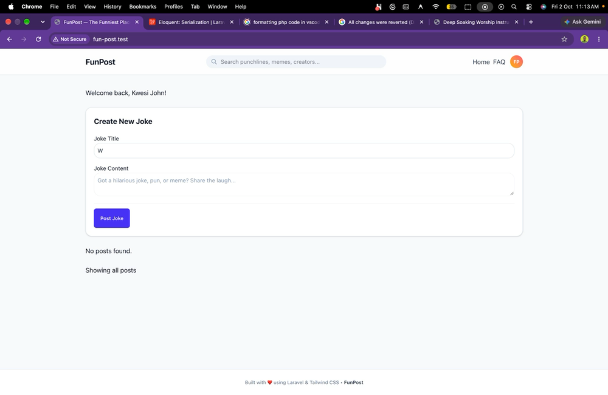
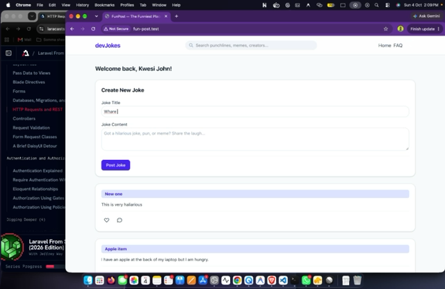
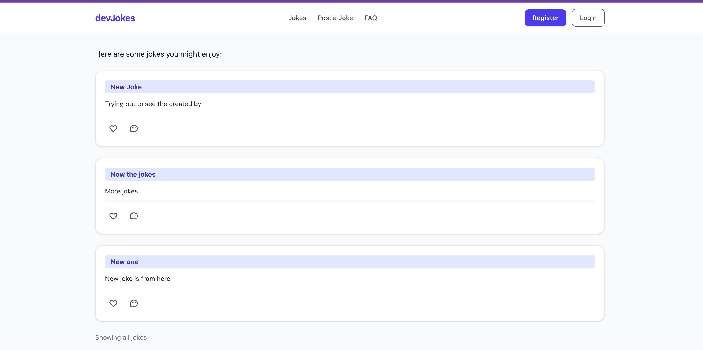
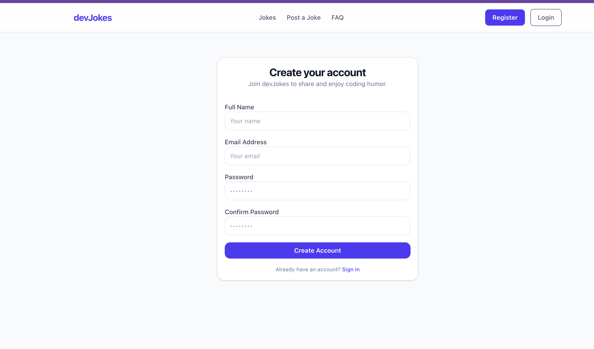
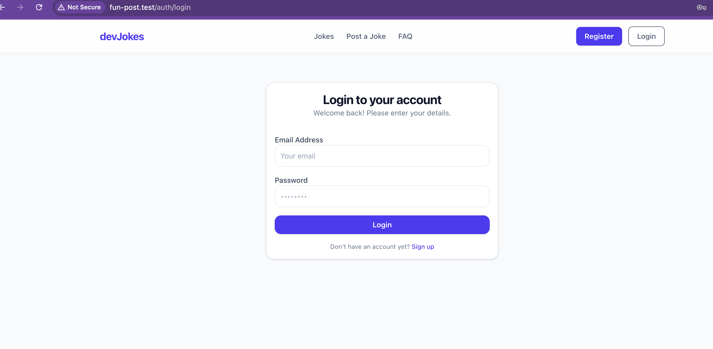
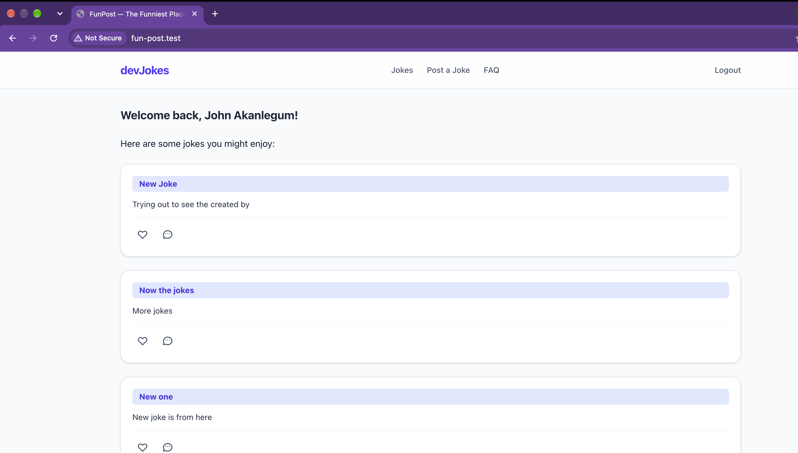

# devJokes ⚡ — My Laravel Mastery Journey

> **Goal:** Master Laravel backend architecture from the ground up to become a proficient full-stack engineer.  
> **Project:** `devJokes` — A developer jokes, puns, and tech humor sharing platform.  
> **Commitment:** 2 hours/day (Tuesday to Thursday) | 6 hours/week | 12 weeks (~72 hours total)  
> **Primary Source:** [Laracasts: Laravel From Scratch](https://laracasts.com/series/laravel-from-scratch-2026) + Official Laravel Docs  
> **Testing Suite:** PHPUnit

---

## ⚡ Daily 2-Hour Breakdown (Code > Bureaucracy)

Spend **85%+ of your time coding and testing**, not writing essays:

| Phase                | Time       | Action                                                                                                                                                               |
| :------------------- | :--------- | :------------------------------------------------------------------------------------------------------------------------------------------------------------------- |
| **1. Watch & Grasp** | **25 min** | Watch 1–2 Laracasts episodes at 1.25x. Understand _what_ problem Laravel solves.                                                                                     |
| **2. Build & Prove** | **85 min** | Translate the concept to `devJokes` (e.g. _Jobs &rarr; Dev Jokes_). Write the code and a **PHPUnit test** proving it works (`php artisan test`). Format with Pint.   |
| **3. Quick Log**     | **10 min** | Jot down 4 quick bullet points in the log below, commit, and push.                                                                                                   |

---

## 🛠️ Developer Toolkit & Quick Reference

### Running the App & Tests

```bash
# Start local development server
composer run dev

# Run all PHPUnit tests
php artisan test

# Run a specific test file or filter by method
php artisan test tests/Feature/JokeTest.php
php artisan test --filter=test_user_can_create_joke

# Format code before committing
vendor/bin/pint --dirty --format agent
```

### Essential Artisan Commands

```bash
php artisan make:controller JokeController --resource   # RESTful resource controller
php artisan make:model Joke -mfs                         # Model with Migration, Factory & Seeder
php artisan make:request StoreJokeRequest               # Form Request with validation
php artisan make:policy JokePolicy --model=Joke         # Authorization Policy
php artisan make:test JokeTest                          # Feature test (PHPUnit)
php artisan make:test JokeUnitTest --unit               # Unit test (PHPUnit)
php artisan route:list                                  # Inspect registered routes
php artisan tinker                                      # Interactive REPL
```

---

## 📋 Daily Learning Log

> _Copy the 5-minute template from the bottom, paste it directly below this line, and fill it in._

### 2026-09-29 — Session 0: Architecture Baseline & PHPUnit Setup

- **Laracasts / Docs Ref:** Setup, Testing Architecture & PHPUnit
- **Core Concept:** Laravel separates Unit tests (testing isolated PHP classes and logic) from Feature tests (boots the full framework lifecycle + in-memory database to test real HTTP requests, session state, and database assertions via `$this->get(...)`).
- **What I Built in FunPost:**
    - Switched testing framework from Pest to PHPUnit (`composer.json`, `phpunit/phpunit`).
    - Converted `tests/Feature/ExampleTest.php` and `tests/Unit/ExampleTest.php` to standard PHPUnit test classes.
    - Untracked generated agent folders (`.claude`, `.factory`) from git to keep commit history clean.
- **PHPUnit Proof:** `php artisan test` &rarr; 2 passed (Unit & Feature example tests).
- **Gotcha / Quick Note:** Git keeps tracking files even after adding them to `.gitignore` if they were already committed; use `git rm -r --cached <dir>` to untrack them cleanly.

### 2026-09-30 — Session 1: Blade Components, Layouts & Props

- **Laracasts Ref:** Blade component architecture, `<x-layout>`, `$slot`, passing props.
- **Core Concept:** Blade components (`<x-component>`) allow building reusable, encapsulated UI blocks. The default `{{ $slot }}` accepts nested HTML/Blade markup, and dynamic PHP variables are passed using colon-prefixed attributes (`:prop="$var"`).
- **What I Built in FunPost:**
    - Built reusable `<x-layout>` component (`resources/views/components/layout.blade.php`).
    - Created `<x-post-form>` component for joke/post creation (`resources/views/components/post-form.blade.php`).
    - Created `resources/views/faq.blade.php` wrapped in `<x-layout>`.
- **PHPUnit Proof:** `php artisan test` &rarr; Passed.
- **Gotcha / Quick Note:** The `x-` prefix tells Blade's compiler to look inside `resources/views/components/` rather than treating it as a standard HTML tag.

### 1st Oct. 2026 — Views, Data Passing, Query Params, Forms & Session Storage

- **Laracasts Ref:** Views & Blade, passing data arrays to views, reading query parameters (`request()`), HTML form handling, `@csrf` protection, POST routes, and Laravel session storage (`session()->push()`, `session()->get()`).
- **Core Concept:**
    - _Data Passing & Query Params:_ Passing data via `return view('home', ['posts' => $posts])` automatically unpacks array keys into variables in Blade (`$posts`). Reading URL query strings is handled via `request('search')`.
    - _Forms & Sessions:_ Standard HTML forms submit POST requests to server endpoints. Laravel enforces `@csrf` tokens on state-changing requests to prevent cross-site request forgery. Transient data across redirects can be stored directly in server sessions (`session()->push('post', $post)`) before database persistence is set up.
- **What I Built in FunPost:**
    - Created `home.blade.php`: used `@dump()` to inspect data, `@foreach` to iterate over posts, and `@if` conditionals for search status and empty states.
    - Added clean static routing with `Route::view('/faq', 'faq')` for the FAQ page.
    - Upgraded `<x-post-form>`: added `@csrf` and field `name` attributes (`name="title"`, `name="content"`).
    - Created `Route::post('/posts')` to receive form data via `request()` and push new jokes into session storage with `session()->push('post', $post)`.
    - In `Route::get('/')`, retrieved session posts via `session()->get('post', [])`, reversed them with `array_reverse()` to show newest jokes first, and displayed them dynamically.
- **PHPUnit Proof:** `php artisan test` &rarr; 5 passed (`PostTest::test_user_can_view_home_page`, `test_user_can_submit_joke_to_session`, `test_user_can_view_faq_page`).
- **Gotchas / Quick Notes:**
    - Use `Route::view('/path', 'view')` when a page is static and doesn't need logic.
    - Forms without `@csrf` immediately fail with `419 Page Expired`.
    - Input elements must have a `name="..."` attribute (not just `id`) for the browser to include their values in the POST request body.
    - In Blade, associative array keys use bracket syntax (`$user['name']`), whereas Eloquent models will use arrow syntax (`$post->title`).

### 2nd Oct. 2026 — Database Migrations, Eloquent Models & Domain Pivot to `devJokes`

- **Laracasts Ref:** Migrations as database version control (`make:migration`, `migrate`, `migrate:rollback`), `up()` vs `down()` schema lifecycles, altering existing tables, migration squashing/skipping, and introductory Eloquent ORM.
- **Core Concept:**
    - _Migrations & Active Record:_ Migrations define and version database schema changes over time. `up()` runs schema additions/modifications and `down()` reverses them. Eloquent Models implement the Active Record pattern, binding a PHP class (`Joke`) to a database table (`jokes`) with methods like `Joke::all()` and `Joke::create()`.
    - _Domain Alignment:_ Domain terminology should match everywhere: Database table (`jokes`), Eloquent Model (`Joke`), Routes (`/jokes`, `/jokes/{id}`), Views (`jokes.index`, `jokes.show`), Components (`<x-joke-form>`), and Test Suites (`JokeTest`).
- **What I Built in devJokes:**
    - **Domain Pivot to `devJokes`:** Shifted application identity from generic "FunPost" to a dedicated developer jokes and coding humor platform: **`devJokes`**.
    - Created initial migration `create_jokes_table` (`id`, `timestamps`, `title`, `content`).
    - Created second migration `add_joke_owner_to_jokes_table` (`joke_owner` nullable column with `dropColumn` rollback in `down()`).
    - Created `App\Models\Joke` model with mass-assignment protection (`protected $fillable = ['title', 'content', 'joke_owner']`).
    - Refactored `routes/web.php` from session storage to true database persistence using `Joke::latest()->get()` and `Joke::create()`.
    - Added single joke permalink route `GET /jokes/{id}` using `Joke::findOrFail($id)`.
    - Reorganized views to standard RESTful conventions: `resources/views/jokes/index.blade.php` and `resources/views/jokes/show.blade.php`.
    - Created `<x-joke-form>` component posting to `POST /jokes`.
    - Updated navigation branding, logo (`devJokes`), and FAQ content.
- **PHPUnit Proof:** `php artisan test` &rarr; 6 passed, 14 assertions (`JokeTest::test_user_can_view_home_page`, `test_user_can_create_joke_in_database`, `test_user_can_view_single_joke`, `test_user_can_view_faq_page`).
- **Demo / Walkthrough:**

  [](docs/recordings/demo-2026-10-02.mp4)

  > 🎥 **[▶️ Click here to play video (MP4)](docs/recordings/demo-2026-10-02.mp4)** &bull; *(also available in [.MOV format](docs/recordings/demo-2026-10-02.mov))*

- **Gotchas / Quick Notes:**
  - When renaming models/tables, the change must ripple through all layers: migrations, model class, route endpoints, view file locations, blade loops, and form actions.
  - When running tests with an in-memory database, add `use RefreshDatabase;` to your test classes so migrations run automatically in the test environment.
  - Eloquent prevents mass-assignment vulnerabilities by default; you must declare allowed fields in `protected $fillable = [...]` before calling `Joke::create(...)`.

### 4th Oct. 2026 — Full CRUD: Edit, Update, Delete & Method Spoofing

- **Laracasts Ref:** RESTful resource actions, updating database records (`PUT`/`PATCH`), deleting records (`DELETE`), method spoofing with `@method`, and debugging Blade components.
- **Core Concept:**
    - _HTTP Method Spoofing:_ Standard HTML forms only support `GET` and `POST` requests natively. For RESTful actions that require `PUT`, `PATCH`, or `DELETE`, Laravel provides HTTP method spoofing: adding `@method('PUT')` or `@method('DELETE')` inside a `POST` form injects a hidden `_method` field that Laravel's router intercepts.
    - _RESTful Update & Delete Conventions:_ Show the edit form via `GET /jokes/{id}/edit`, submit updates to `PUT /jokes/{id}`, and trigger deletions via `DELETE /jokes/{id}` with redirect flows.
- **What I Built in devJokes:**
    - Created edit page view [`resources/views/jokes/edit.blade.php`](resources/views/jokes/edit.blade.php) wrapped in `<x-layout>`.
    - Upgraded `<x-joke-form>` to support both creation (`type="new"`) and editing (`type="edit"`), binding existing values with `old('title', $joke->title)` and `@method('PUT')`.
    - Added `GET /jokes/{id}/edit`, `PUT /jokes/{id}`, and `DELETE /jokes/{id}` routes in [`routes/web.php`](routes/web.php) with mass-update (`$joke->update(...)`) and deletion (`$joke->delete()`).
    - Added Edit and Delete action controls directly to single joke detail view [`resources/views/jokes/show.blade.php`](resources/views/jokes/show.blade.php) with browser confirmation prompts.
- **PHPUnit Proof:** `php artisan test` &rarr; 9 passed, 26 assertions (`test_user_can_view_edit_joke_page`, `test_user_can_update_joke_in_database`, `test_user_can_delete_joke_from_database`).
- **Demo / Walkthrough:**

  [](docs/recordings/demo-2026-10-04-crud.mp4)

  > 🎥 **[▶️ Click here to play video (MP4)](docs/recordings/demo-2026-10-04-crud.mp4)** &bull; *(also available in [.MOV format](docs/recordings/demo-2026-10-04-crud.mov))*

- **Gotchas / Quick Notes:**
    - In Blade components, pass dynamic variables using colon syntax (`:joke="$joke"`), not React/JSX syntax (`joke={$joke}`).
    - HTML `<textarea>` does not have a `value="..."` attribute; content must be placed between the tags: `<textarea>{{ $value }}</textarea>`.
    - Array keys in `@props` must be quoted strings (e.g., `'endpoint' => null`), otherwise PHP treats barewords as undefined global constants.

### 5th Oct. 2026 — Resource Controllers, Route Model Binding & Form Validation

- **Laracasts Ref:** Controllers (`php artisan make:controller JokeController --resource`), Implicit Route Model Binding, RESTful action conventions (`index`, `create`, `store`, `show`, `edit`, `update`, `destroy`), `Route::resource`, and Form Validation with `$request->validate()`.
- **Core Concept:**
    - _Resource Controllers:_ While route closures work well for quick prototypes, controllers group related HTTP actions for a resource into a dedicated class, keeping `routes/web.php` clean and separating routing definitions from request-handling logic.
    - _Implicit Route Model Binding:_ Type-hinting `Joke $joke` in controller actions replaces manual `Joke::findOrFail($id)` calls. Laravel automatically matches the route wildcard (e.g. `{joke}`) to the variable name (`$joke`), performs the database lookup, and aborts with a 404 if the record doesn't exist.
    - _Controller Validation & Error Bags:_ Calling `$request->validate([...])` inside controller actions inspects request inputs against rules (`required`, `string`, `min:5`, `max:255`). If validation fails, Laravel halts execution, flashes error bags and old input to the session, and automatically redirects back.
    - _Blade Error Directives:_ Blade's `@error($name)` directive conditionally renders error feedback, providing a scoped `$message` variable to display user-friendly validation messages.
- **What I Built in devJokes:**
    - Generated [`app/Http/Controllers/JokeController.php`](app/Http/Controllers/JokeController.php) implementing all 7 resource methods (`index`, `create`, `store`, `show`, `edit`, `update`, `destroy`).
    - Added backend validation in `JokeController::store()` validating `title` (min 5) and `content` (min 10, max 255).
    - Created reusable form error component [`resources/views/components/forms/error.blade.php`](resources/views/components/forms/error.blade.php) using `@props`, `@error($name)`, and `$message`.
    - Integrated `<x-forms.error name="title" />` and `<x-forms.error name="content" />` into [`resources/views/components/joke-form.blade.php`](resources/views/components/joke-form.blade.php).
    - Decoupled joke creation from the home feed into its own dedicated view: [`resources/views/jokes/create.blade.php`](resources/views/jokes/create.blade.php).
    - Added a global **"Post a Joke"** CTA button in the main header navigation ([`resources/views/components/layout.blade.php`](resources/views/components/layout.blade.php)) linking to `/jokes/create`.
    - Streamlined [`routes/web.php`](routes/web.php) to use `Route::resource('jokes', JokeController::class)`.
- **PHPUnit Proof:** `php artisan test` &rarr; 9 passed, 26 assertions (`JokeTest`).
- **Gotchas / Quick Notes:**
    - **Wildcard naming matters:** Implicit route model binding requires the route parameter `{joke}` to match the method parameter name `$joke`. If you use `{id}`, Laravel fails to bind the model and injects a blank instance instead.
    - **Route paths vs `Route::resource`:** Generic linters warn about duplicate string literals like `"/jokes/{joke}"`. The idiomatic Laravel fix isn't defining PHP constants, but using `Route::resource`.
    - **Root URL check:** `Route::resource('jokes', ...)` binds `/jokes`, so ensure your root path `GET /` is also explicitly mapped: `Route::get('/', [JokeController::class, 'index']);`.
    - **Form error naming:** Error components must match the form field `name` attribute (`content`, not `description`) for `@error` to find the session error bag.
    - **HTML5 vs Backend validation:** Client-side HTML5 `required` attributes intercept submissions in the browser before the request reaches Laravel's `$request->validate()`.

### 6th Oct. 2026 — User Authentication: Registration, Sessions & Auth Blade Directives

- **Laracasts Ref:** Authentication fundamentals, `RegisteredUserController`, `SessionsController`, `Auth::attempt()`, `Auth::login()`, `Auth::logout()`, and Blade `@auth` / `@guest` directives.
- **Core Concept:**
    - _Stateful Session Authentication:_ Laravel manages web authentication by verifying credentials, issuing an encrypted session cookie via `Auth::attempt($credentials)` or `Auth::login($user)`, and clearing session data on `Auth::logout()`.
    - _Password Security & Confirmation:_ User passwords must always be securely hashed before persistence (`bcrypt($request->password)` or `Hash::make()`). The `confirmed` rule enforces that `password` matches the `password_confirmation` field automatically.
    - _Conditional UI Directives:_ Blade's `@auth` and `@guest` directives cleanly toggle interface elements (e.g. login/register buttons vs logout button and user greetings) based on user authentication status.
- **What I Built in devJokes:**
    - **User Registration Flow:**
        - Built [`app/Http/Controllers/Auth/RegisteredUserController.php`](app/Http/Controllers/Auth/RegisteredUserController.php) with `create` and `store` methods.
        - Enforced strict registration validation: `name` (required, max 255), `email` (valid email, `unique:users`), and `password` (min 8, confirmed, `RulesPassword::default()`).
        - Saved new users with hashed passwords and auto-authenticated them immediately via `Auth::login($user)`.
        - Created the registration UI in [`resources/views/auth/register.blade.php`](resources/views/auth/register.blade.php) with integrated field-level error messages.
    - **Session Login & Logout Flow:**
        - Built [`app/Http/Controllers/Auth/SessionsController.php`](app/Http/Controllers/Auth/SessionsController.php) handling login form display (`create`), authentication check (`store`), and session invalidation (`destroy`).
        - Implemented credential verification with `Auth::attempt()`, returning friendly error feedback with `back()->withErrors(...)` and flashing old inputs on failure.
        - Handled secure logout using `Auth::logout()` and redirect with flash feedback.
        - Created login UI in [`resources/views/auth/login.blade.php`](resources/views/auth/login.blade.php).
    - **Header Navigation & Personalized UI:**
        - Updated [`resources/views/components/layout.blade.php`](resources/views/components/layout.blade.php) with `@guest` (showing Register and Login buttons) and `@auth` (rendering a secure `@method('DELETE')` Logout button).
        - Updated [`resources/views/jokes/index.blade.php`](resources/views/jokes/index.blade.php) with `@auth` greeting: `"Welcome back, {{ $user->name }}!"`.
        - Passed `Auth::user()` from `JokeController::index()`.
    - **Routes:** Added auth endpoints (`GET/POST /auth/register`, `GET/POST /auth/login`, and `DELETE /auth/logout`) in [`routes/web.php`](routes/web.php).
- **UI Walkthrough / Screenshots:**
    - **1. Guest Home Page (Register & Login CTAs):**
      
    - **2. Registration Form (`/auth/register`):**
      
    - **3. Login Form (`/auth/login`):**
      
    - **4. Authenticated Home Page (Welcome Greeting & Logout CTA):**
      
- **Gotchas / Quick Notes:**
    - **Namespace vs Directory structure:** Subdirectory controllers like `app/Http/Controllers/Auth/` must declare `namespace App\Http\Controllers\Auth;` to satisfy Composer's PSR-4 autoloading and avoid `ReflectionException`.
    - **Logout security:** Logout should always be a state-changing `POST` or `DELETE` request with `@csrf` rather than a simple `GET` link to guard against CSRF vulnerabilities.
    - **Testing:** Unit/Feature tests for authentication are deferred to a dedicated testing session.

<!-- INSERT NEXT DAILY ENTRY HERE -->


---

## 🗓️ 3-Month Mastery Roadmap (devJokes Milestones)

### Month 1: Core Architecture, CRUD & TDD Foundations

- [ ] **Week 1: Setup, Routing, & The HTTP Lifecycle**
    - [x] Session 1 (Tue): Project structure, Artisan CLI, `routes/web.php` & `routes/api.php`, route parameters, named routes.
    - [x] Session 2 (Wed): Resource Controllers (`JokeController`), returning views & JSON responses.
    - [x] Session 3 (Thu): PHPUnit Feature testing basics: asserting HTTP status, view contents, and redirect headers.
- [ ] **Week 2: Database Schema, Migrations & Eloquent ORM**
    - [ ] Session 4 (Tue): Database migrations, schema constraints (`jokes` table with foreign key `user_id`).
    - [ ] Session 5 (Wed): Eloquent Model conventions, `$fillable` mass assignment protection, basic queries.
    - [ ] Session 6 (Thu): Model Factories & Database Seeders with Faker (`JokeFactory`).
- [ ] **Week 3: Validation, Form Requests & Error Handling**
    - [ ] Session 7 (Tue): Controller validation rules, error bags, status codes.
    - [ ] Session 8 (Wed): Custom Form Requests (`StoreJokeRequest`, `UpdateJokeRequest`) isolating validation from controllers.
    - [ ] Session 9 (Thu): PHPUnit tests asserting 422 Unprocessable Content and session validation errors.
- [ ] **Week 4: Authentication & User Scoping**
    - [x] Session 10 (Tue): Laravel Authentication (Breeze / session auth flow).
    - [ ] Session 11 (Wed): Associating jokes with the authenticated user (`$request->user()->jokes()->create(...)`).
    - [ ] Session 12 (Thu): **Month 1 Review:** Registered users can create and view their dev jokes with 100% PHPUnit coverage.

### Month 2: Relational Architecture, Interactions & Authorization

- [ ] **Week 5: One-to-Many Relationships (Comments System)**
    - [ ] Session 13 (Tue): Migration & Model for `comments` (`Joke hasMany Comments`, `Comment belongsTo User`).
    - [ ] Session 14 (Wed): Nested resource controllers for adding and reading comments on jokes.
    - [ ] Session 15 (Thu): PHPUnit tests for comment creation and relationship integrity.
- [ ] **Week 6: Polymorphic Relations (Likes System)**
    - [ ] Session 16 (Tue): Polymorphic database design (`likeable_id`, `likeable_type`) so users can like jokes or comments.
    - [ ] Session 17 (Wed): Idempotent toggle-like action (like / unlike).
    - [ ] Session 18 (Thu): PHPUnit tests verifying that duplicate likes cannot be created.
- [ ] **Week 7: Self-Referential Many-to-Many (Followers & Feed)**
    - [ ] Session 19 (Tue): Pivot table `follows` (`follower_id`, `following_id`).
    - [ ] Session 20 (Wed): Generating the personalized Feed query (jokes from followed creators).
    - [ ] Session 21 (Thu): Solving the N+1 query problem: eager loading (`with()`) and `withCount(['likes', 'comments'])`.
- [ ] **Week 8: Authorization (Gates & Policies)**
    - [ ] Session 22 (Tue): Laravel Gates vs. Policies (`php artisan make:policy JokePolicy`).
    - [ ] Session 23 (Wed): Authorizing edit/delete actions (preventing users from editing someone else's joke).
    - [ ] Session 24 (Thu): **Month 2 Review:** Full social interactions (likes, comments, follows) secured with PHPUnit policy tests.

### Month 3: Production Backend, Files, Queues & Full-Stack API

- [ ] **Week 9: Media Handling & File Storage**
    - [ ] Session 25 (Tue): Storage disks (`config/filesystems.php`, `public` disk, `storage:link`).
    - [ ] Session 26 (Wed): Meme / image uploads with size and MIME validation.
    - [ ] Session 27 (Thu): PHPUnit tests using `Storage::fake('public')` and `UploadedFile::fake()->image()`.
- [ ] **Week 10: Events, Listeners & Notifications**
    - [ ] Session 28 (Tue): Event-Driven architecture (`JokeLiked`, `UserFollowed`).
    - [ ] Session 29 (Wed): Database and in-app notifications.
    - [ ] Session 30 (Thu): PHPUnit testing events & notifications with `Event::fake()` and `Notification::fake()`.
- [ ] **Week 11: Background Jobs & Queues**
    - [ ] Session 31 (Tue): Queue driver configuration and creating background jobs (`php artisan make:job`).
    - [ ] Session 32 (Wed): Moving heavy tasks (e.g., thumbnail generation, weekly digest emails) to background queues.
    - [ ] Session 33 (Thu): PHPUnit tests with `Queue::fake()`.
- [ ] **Week 12: API Resources & End-to-End Delivery**
    - [ ] Session 34 (Tue): Eloquent API Resources (`JokeResource`, `CommentResource`) for clean JSON transformation.
    - [ ] Session 35 (Wed): Sanctum token authentication for connecting to SPAs, mobile apps, or external clients.
    - [ ] Session 36 (Thu): **Final Milestone:** Full test suite run (`php artisan test`), code styling (`pint`), final retrospective.

---

## 📝 5-Minute Daily Log Template

> Copy and paste this at the top of the "Daily Learning Log" section after each session. Keep it concise—just the facts and code.

```markdown
### [YYYY-MM-DD] — Session X: [Feature / Topic]

- **Laracasts Ref:** [Ep # or Topic]
- **Core Concept:** [1-2 sentences on how the feature or architecture works]
- **What I Built in devJokes:** [1-2 bullets on models, migrations, or endpoints created]
- **PHPUnit Proof:** [Test file or method that passed]
- **Gotcha / Quick Note:** [1 sentence if an error or edge case tripped you up]
```
